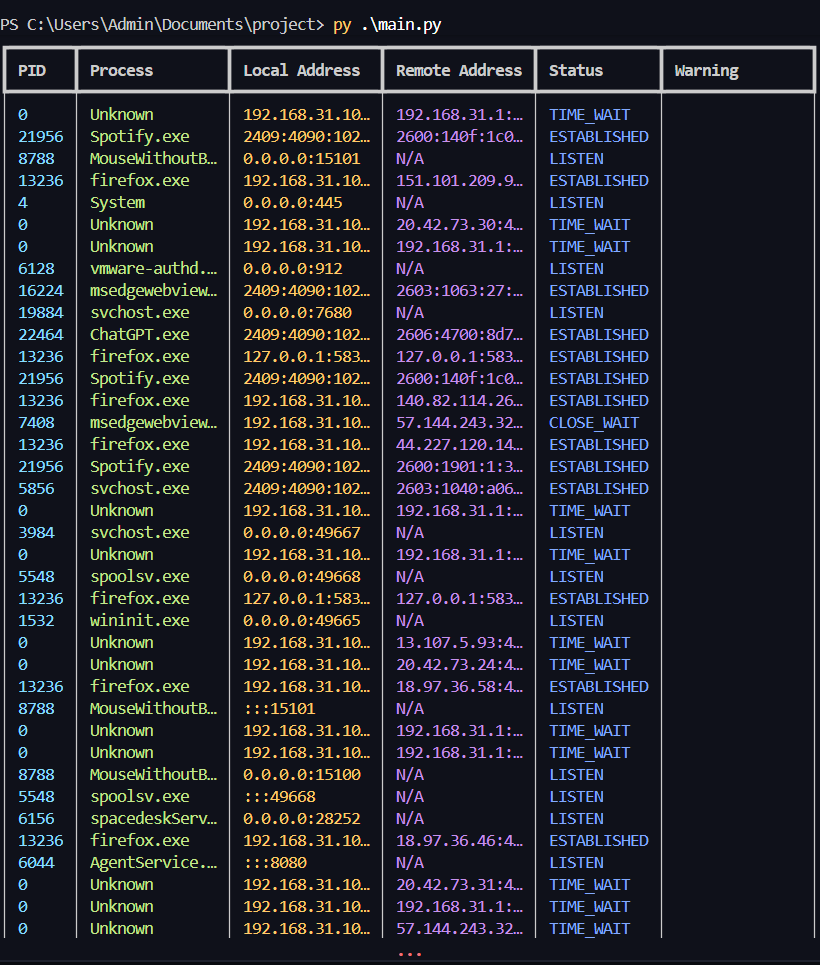

# CyberWatch

A real-time TCP network monitoring tool built with Python.

## Features

- Live TCP connection monitoring
- Process name detection
- Listening port detection
- External IP visibility
- Suspicious port warnings
- Real-time dashboard updates
- Professional terminal UI

## Technologies Used

- Python
- psutil
- rich

## Installation

```bash
pip install -r requirements.txt
```

## Run

```bash
py main.py
```

## Screenshot



## Learning Goals

This project was built to learn:

- TCP/IP networking
- Socket analysis
- Process monitoring
- Cybersecurity fundamentals
- Real-time terminal dashboards# cyberwatch

## Future Improvements

- Real-time traffic graphs
- Export connection logs
- Suspicious IP detection
- GeoIP lookup
- Packet sniffing support
- Bandwidth monitoring
